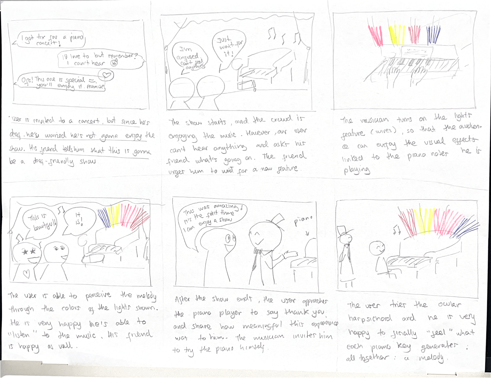
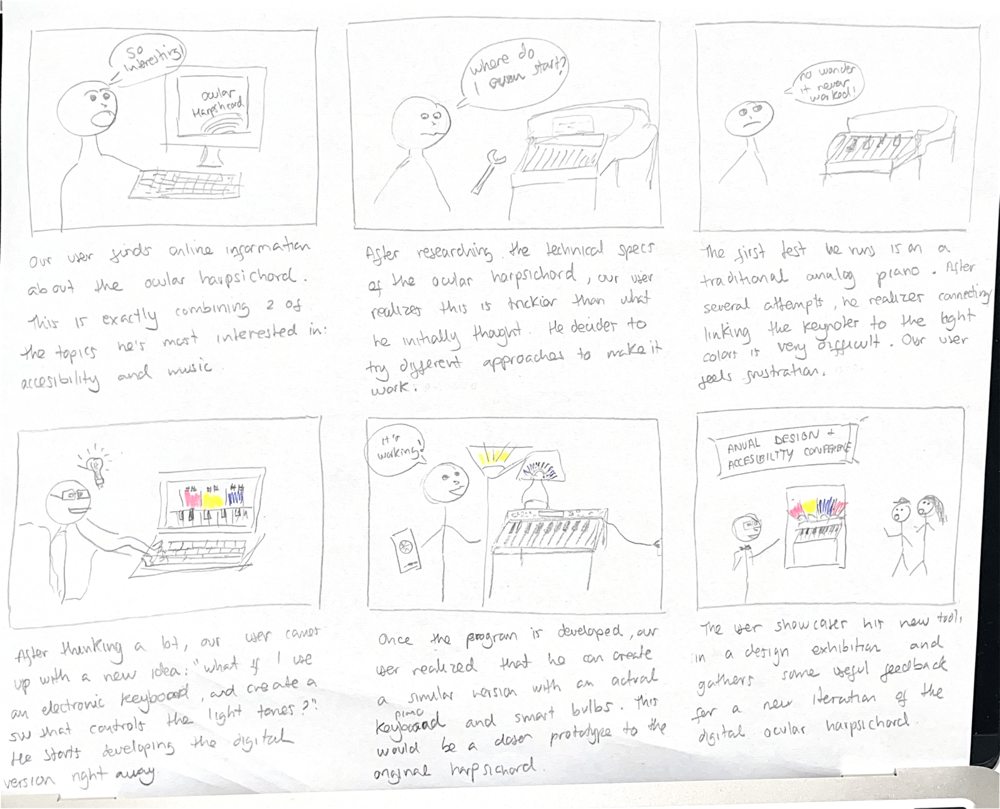
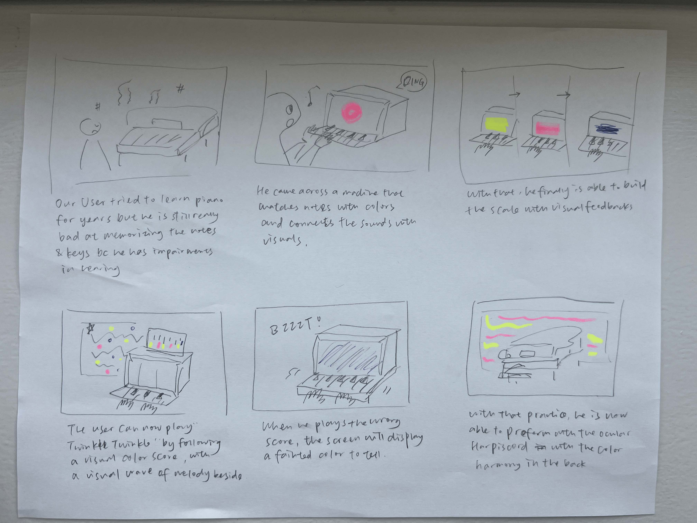

# Recreating the Masters of Interactive Light

_This project is to be done in teams of 2._

**NAME OF BOTH COLLABORATOR(S) HERE:** Gabriela Yaulli, Aurora Jiaxin Shen

**THE MASTERWORK YOU DREW FROM THE HAT: The Ocular Harpsichord**

---

One way to understand greatness is to look to the greats. Just as painters learn
the technique and artistry of the old masters by recreating their paintings, so
too shall we come to understand computer-mediated interaction by recreating the
interactive masterworks of our time.

This week, every team will draw a different masterwork from a hat. Some are
conceptual pieces, some are historical works, some are modern-day products —
but they all share one thing: **their central mode of interaction is carried by
light.** Think of Tinker Bell in the original stage production of *Peter Pan*,
represented by nothing more than a darting circle of light from an off-stage
mirror. There was no actor playing Tinker Bell; she existed entirely through the
way the other characters interacted with that light.

Your job is to recreate the *interaction* of the piece you drew — not to build a
museum-grade replica, but to stage the moment that makes it what it is. Someone
who knows your piece should watch your recreation and recognize it instantly.
Someone who has never heard of it should walk away understanding what it is
famous for.

You will do this using the interaction staging techniques we will use all semester: a
storyboard, some acting, a phone standing in as a controllable light (the
*Tinkerbelle* tool), a hidden human "wizard" driving it, a costume, and a
recorded video.

*Make sure you read all the instructions and understand the whole activity
before starting!*

## Prep

To start, you will need:

1. Read about Git [here](https://git-scm.com/book/en/v2/Getting-Started-What-is-Git%3F).
2. Set up your own Github "Lab Hub" by forking the [Interactive-Lab-Hub repository](https://github.com/IRL-CT/Interactive-Lab-Hub). To get lab updates, simply use [GitHub's "Sync fork" button](https://docs.github.com/en/pull-requests/collaborating-with-pull-requests/working-with-forks/syncing-a-fork) when new content is available.

3. Set up your `README.md` so it has your name and links to this lab. Learn to
   format a README [here](https://docs.github.com/en/get-started/writing-on-github/getting-started-with-writing-and-formatting-on-github/basic-writing-and-formatting-syntax).
4. **Draw your masterwork from the hat and write it at the top of this file.**
   Whatever you drew is yours — lean into it.

## Materials

For this lab you will need:

1. Paper, markers/pens, scissors
2. A smartphone with a browser that can display a webpage (your stand-in "light")
3. A computer to host the control webpage
4. Found objects and materials to **costume your phone so it looks like the
   device in your masterwork** — doll clothes, a paper lantern, a bottle, foil,
   a cardboard shell, whatever it takes. Be resourceful.

## Deliverables

Submit all of the following in this lab folder of your Lab Hub, as links or
uploaded files. **Each group member posts their own copy to their own Github repo**, even if the work is
shared.

1. A short **research write-up** of your masterwork (what it is, when, who made
   it, and — most importantly — what the interaction is)
2. **3 iterated storyboards** of the interaction in the masterwork
5. A **video sketch** of your prototyped interaction
6. Any **reflections** on the process

Labs are due on Mondays. Make sure this page is linked from your main class hub
page.

---

# The Report

## Part 0. Know Your Master

Before you prototype anything, get intimately acquainted with the piece you
drew. Do real research. You are looking less for trivia than for the *shape of
the interaction*:

- What inputs are available to the user? What responses does the work give?
- Who is present, and how does the piece color the relationships between them?
- What is the piece famous for? What are its strengths and its weaknesses?

  Sometimes the details of how the interaction worked are lost in history. Try filling it in with your imagination!

**Describe your masterwork here, in your own words. What is the core interaction
someone would recognize it by?**

## What it is
Castel’s ocular harpsichord was designed as a conventional musical keyboard augmented with a visual mechanism. Instead of producing only audible notes, each key was intended to reveal a particular color. Castel associated musical pitch with color according to his own theory of color-sound correspondence, creating what he called “music for the eyes.”

The design anticipated later color organs, stage-lighting systems, audiovisual performance, and interactive media. Rather than treating color as a static decoration, it made color temporal: colors would appear, change, combine, and disappear in the rhythm and structure of a performed piece of music.

## When and who made it
Castel first published the idea in November 1725 in an article titled “Harpsichord for the eyes, with the art of painting sounds”. He continued developing and publicizing variants of the concept for nearly three decades. Accounts describe demonstrations or prototypes in the 1730s and a presentation to an audience in Paris in December 1754. However, historians disagree about the extent to which a fully working instrument was ever completed; the ocular harpsichord is therefore important both as a proposed machine and as a widely discussed design concept.

## The interaction
The core interaction is a direct key-to-color mapping:

1. A performer presses a key on the keyboard.
2. Mechanical linkages connected to that key activate a small shutter, panel, or window.
3. The shutter opens to expose colored paper, colored ribbons, or light shining through stained glass.
4. The corresponding color becomes visible at the same moment as the musical note.
5. When several keys are pressed together, the audience experiences a visual equivalent of a musical chord: multiple colors appearing in combination.

Some versions described a box above the keyboard containing colored glass panels and candles. Pressing a key would open a small curtain or window, allowing candlelight to pass through the glass. This made the output vivid, event-based, and legible to spectators: the user’s finger movement was translated into changing light.

## Why the interaction matters
The ocular harpsichord changes music from an exclusively auditory experience into one that can be seen. It creates a relationship among performer, instrument, audience, sound, and light:

The performer still uses a familiar keyboard interface, so the interaction builds on existing musical knowledge rather than requiring a new control system.
The audience receives immediate feedback: every note has a visible consequence.
The visual output is not merely synchronized to music after the fact; it is mechanically caused by the performer’s action.
Castel hoped the instrument could make musical structure accessible to deaf viewers, although this premise assumes that color mappings could meaningfully substitute for hearing and should be understood as an eighteenth-century ideal rather than an established accessibility solution.

## Part A. Plan

For your masterwork, reconstruct the interaction as a scene:

- **Setting:** Where and when does this interaction happen? (a jungle, a kitchen,
  a spaceship corridor, a nightclub, a harbor at night)
- **Players:** Who is involved? Who else is present? Think through everyone in
  the setting, not just the primary user.
- **Activity:** What is happening between the players and the light?
- **Goals:** What is each player trying to do?

**Describe your setting, players, activity, and goals here.**

Now **sketch a 3 storyboards** of the interaction you are recreating. (The number may depend on the thing you drew, but stretch your thinking!) They
don't need to be beautiful, but they must capture and communicate not only the behavior of the light, but how it affects
and the people around it. If you're new to storyboarding, read
[this explanation](https://www.nngroup.com/articles/storyboards-visualize-ideas/).

**Include pictures of your storyboards here.**

Use the storyboards to decide what interaction to prototype.

**Summarize the feedback you got here.**
On paper, we assumed users would look at the screen while playing. In reality, people spent most of their time looking down at their fingers to find the keys and missed subtle, fast color shifts on the vertical screen. We realized the light needs to spill downwards onto the performer's hands so they can catch color changes in their peripheral vision without having to look up.
Given open-ended instructions and no access to Maker Lab, we relied on the natural springiness of folded paper to simulate mechanical key travel and bounce-back, and we are still exploring the possible interactions of the light inside the dark cardboard chamber to connect.
A few questions we’ve been struggling with: How does a user understand that a mechanical press controls both light and tone? How do we establish a clear, legible rule system rather than random color flashes? How does the presence of light respond to key velocity, hold duration, and chord combinations?

## Part B. Act out the Interaction

Physically act out the interaction you planned. For now, just pretend the light
is doing what you've scripted — a person can wave a flashlight, or you can narrate
it aloud.

**Are there things that seemed better on paper than when acted out?**

**Did new ideas about the piece surface once you were on your feet?**

**Are there key moments in the interaction where things could go in a different direction?**
Iterate your storyboards to capture key non-sequential aspects of the interaction. 

## Part C. Prototype the Light (light first!)

Use your smartphone as the light of your device. Open the browser on your phone
to act as the "light," and use the remote control interface on your computer to
change that light. Code and setup instructions for the *Tinkerbelle* tool are
[here](https://github.com/IRL-CT/tinkerbelle) (we invented this tool for
this lab). If you hit technical trouble, a manually or remotely controlled light
switch, dimmer, or lamp is a fine substitute.

**Get the light interaction working before anything else.** Your grade this week
rides on the *light* being recognizable — the color, the rhythm, the timing, the
way it answers a person. Only once your light interaction genuinely reads as your
masterwork should you consider layering in a second modality (sound, vibration,
motion). If in doubt, keep polishing the light. The other modalities are next
week's business.

## Part D. Wizard the Device

Set up a "wizard" arrangement so one person can secretly drive the light while
another acts with it — this is how you make the device feel alive without
building any real electronics. (Zoom works well for recording; you can pin the
video feed of whichever scene you want to capture.)

**Include your first attempts at recording the wizarded set-up here.**

### Video Link: 
https://youtu.be/Uuq3DWgwCAc

## Part E. (optional) Costume the Device

Only now should you worry about what the device looks like. Costume your phone so it reads
as the object from your masterwork — HAL's eye, a Simon shell, a paper-lantern
Tinker Bell, an Ambient Orb, a lighthouse, a jack-o'-lantern, whatever you drew.

Think about the world your device lives in: could that environment overheat it?
Is water a danger? Does it need to be loud and bright for an emergency, or quiet
and calm for a bedroom?

**Include sketches/photos of what your device might look like here.**

**What concerns or opportunities shaped the way you designed its look?**

## Part F. Record

**Record your prototyped interaction as a video sketch.** Aim for the bar from
the top of this lab: a viewer who knows the piece should recognize it; a viewer
who doesn't should come away understanding what it's famous for. How might you illustrate the non-sequential aspects of the interaction in the sketch?

**Include your video here.**

Video link: https://youtu.be/f5B84nFMJJM

**Please indicate who you collaborated with on this lab.** Be generous in
acknowledging their contributions, and credit any other influences (YouTube,
Github, Twitter, a friend who lent you a lamp) that informed your recreation.

I worked on this project with Aurora, and it was a team effort. Aurora dug into how to use the Tinkerbell tool, and I came up with the idea of using a color palette to simulate the colors changing dynamically as the piano is played. We did the ideation and storyboarding together, gathered feedback from others, and worked side by side on the remastering. Along the way, we leaned on YouTube tutorials, GitHub repos, and online forums whenever we got stuck.

---

# Part 2 — ReMastering the light

*This describes the second week's work for this lab activity.*

## Prep (before the next lab)

Find three other groups. (How? Maybe Slack?) Visit their Lab Hub pages, watch their
videos, and give them reactions and feedback: tell them what you saw happening,
guess the masterwork and the goals of the characters, and ask about anything that
wasn't clear.

**Who were the other groups you kibitzed with? Add links to their project pages here.**
**Summarize the feedback you got from your partners here.**
- Demi Hu — The masterwork reads as a proposed machine (sources disagree on whether a working instrument was ever finished), so the physical form is genuinely open. Wanted to know the mapping rule: is every key⇄colour pair fixed (all C's red, all D's orange…), or does colour depend on volume, speed, or timing? Where does the "box" live — is it occupying the same space as the keyboard, or is it a separate art piece? After the video she still couldn't tell how each keypress produced its colour (she noticed we were using a random palette generator, which is a technical limitation, not an interaction choice). She appreciated how thorough the storyboards were and liked the narrative of a deaf person enjoying a melody through visuals.

- Chih-Hsin Liu — Loved the beat where the device is placed back on the doll's heart and lights up instantly — it helped him "catch" the masterpiece. But he felt the light responding to a doll is less compelling than the light responding to a person, and that the piece needs more human interaction overall.

- Monica Wei — Found it easy to read ("playing the piano changes the colour of the light") and thought the accuracy was high. Suggested dressing the laptop up to look like a piano, and making the light's colour layout correspond to the physical keyboard layout.

What the feedback has in common
All three are asking for the same missing thing: a legible rule. Castel's whole proposal was a fixed correspondence between pitch and colour, so that music becomes something you can see (and, as Demi noticed, something a deaf audience could follow). Our Part 1 prototype showed the idea of sound-made-visible but hid the system, because the colours were random. Chih-Hsin and Monica are also pushing on the same axis from the other side: make the response clearly caused by a human performer, and make the spatial layout of the colour match the instrument.

## Remix, Update, or Critique the Master

Now that you understand your masterwork from the inside, respond to it. Do the
recreation again, but this time make it your own — pick one of these moves (or
combine them):

1. **Remix the modality.** Your recreation no longer has to (just) use light. Use
   vibration, sound, motion, heat — whatever best carries the interaction. Feel
   free to fork and modify the Tinkerbelle code. (Add your updates to this lab's folder!)
2. **Update it.** Redesign the piece for today's context, or for a setting its
   creators never imagined (the piece with roommates in the room, with children
   present, on a phone, in a car).
3. **Fix its weaknesses.** You identified this master's strengths and weaknesses
   in Part 0 — now address a weakness, or push a strength further.

We will grade this second pass with an emphasis on **creativity** and on how well
your response engages with what your master was really doing.

**Document everything here — especially the storyboard and video. Photos of the
prototype are great too.**

We chose to address the weakness every reviewer named — the mapping was arbitrary — by rebuilding the recreation around Castel's actual colour scale, and by making the dynamics of playing (not just which key) drive the light. This is what our master was really doing: proposing that pitch and colour are the same underlying order, perceivable together.

Concretely, our ReMaster replaces the random palette with a deterministic instrument:
| Input (what the performer does) | Output (what the light does) |
|---|---|
| **Which key** (pitch) | **Hue**, from Castel's 1725 colour scale — C = blue, D = green, E = yellow, F = fawn, G = red, A = violet, B = indigo, with the semitones between. Fixed, every octave. |
| **How hard / how fast you re-strike** (velocity) | **Brightness** of the wash |
| **How long you hold** (duration) | Light **sustains** while held, then **fades** slowly on release |
| **Multiple keys together** (a chord) | Colours **blend additively** into one combined light — a visible chord |
| Playing at all | Light **spills downward onto the performer's hands** (our Part 1 finding) and an on-screen key lights in its own colour, laid out left-to-right like the keyboard |
| Pressing **L** | A **legend** overlays the full pitch→colour rule, making the system teachable on camera |

The remix element: the light is no longer only a vertical screen the performer ignores. It now has two surfaces — the ambient wash behind the instrument (for the audience) and the spill onto the hands (for the performer, in peripheral vision). This directly acts on our Part 1 discovery that players look down at their fingers.

Answering Chih-Hsin: in the new recreation the light responds to the performer's touch and dynamics, not to an object being docked. The "aha" beat becomes: a hearing player and a Deaf friend at the same keyboard, the Deaf friend plays a phrase and sees the melody's shape in colour, and the hearing player closes their eyes and follows the same phrase by ear. Same order, two senses.

Answering Monica: the on-screen keys sit in keyboard order and each lights its own Castel colour, so the colour "layout" is the instrument layout. (Physical build: paper keys taped over the laptop keys, see prototype photos.)

### Video
https://youtu.be/f5B84nFMJJM

How this engages with what the master was really doing
Castel wasn't building a light show; he was making a claim that pitch and colour share one structure and can be perceived at once. Our Part 1 recreation demonstrated the sensation but not the claim. By making the mapping fixed, rule-based, and visible, and by letting the performer's dynamics shape the light, the ReMaster lets an audience actually test Castel's idea: play the same phrase twice and the colours are the same both times. That falsifiability is the thing that makes it an instrument rather than a mood lamp.

---

*Assignment lineage: this lab merges "Staging Interaction" (Interactive Lab Hub)
with "Recreating the Masters" (Interaction Design Studio, Profs. Scott Minneman &
Wendy Ju). Massive list of interactive light masterworks generated by Claude.ai.*
